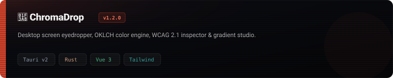
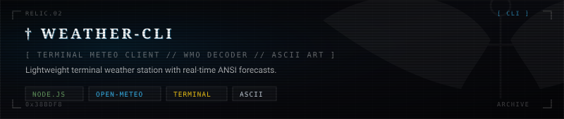

<div align="center">

  

  <br/><br/>

  <a href="https://skillicons.dev">
    
  </a>

</div>

<br/>

---

### 01 // Projects

<div align="center">

  <a href="https://github.com/thund3r1331/chromadrop">
    
  </a>

  <br/><br/>

  <a href="https://github.com/thund3r1331/weather-cli">
    
  </a>

</div>

<br/>

---

### 02 // Overview

```rust
struct Profile {
    alias: &'static str,
    focus: Vec<&'static str>,
    stack: Vec<&'static str>,
}

let thund3r = Profile {
    alias: "thund3r",
    focus: vec!["Desktop Applications", "Rust Tooling", "Web Systems"],
    stack: vec!["Rust", "TypeScript", "Vue 3", "Tauri", "Tailwind CSS"],
};
```

---

<br/>

<div align="center">
  
  
  
</div>
