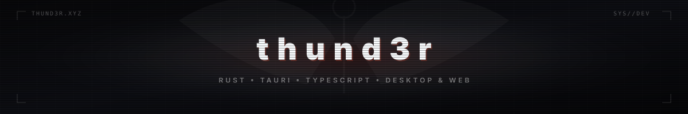

<div align="center">

  

  <br/><br/>

  <!-- Dark Tech Stack Badges -->
  <a href="https://skillicons.dev">
    
  </a>

</div>

<br/>

---

### † Featured Relics

<table>
  <tr>
    <td width="50%">
      <h3 align="center"><a href="https://github.com/thund3r1331/chromadrop">🎨 ChromaDrop</a></h3>
      <p align="center">
        Ultra-fast desktop screen eyedropper, OKLCH converter, WCAG 2.1 accessibility suite & gradient studio.
      </p>
      <p align="center">
        <code>Tauri v2</code> • <code>Rust</code> • <code>Vue 3</code> • <code>Tailwind</code>
      </p>
    </td>
    <td width="50%">
      <h3 align="center"><a href="https://github.com/thund3r1331/weather-cli">⛅ weather-cli</a></h3>
      <p align="center">
        Minimalist terminal weather station with real-time WMO decoding, ASCII art & ANSI styling.
      </p>
      <p align="center">
        <code>Node.js</code> • <code>Open-Meteo API</code> • <code>CLI</code>
      </p>
    </td>
  </tr>
</table>

---

### † Soul Schema

```rust
struct Soul {
    alias: &'static str,
    status: &'static str,
    affinity: Vec<&'static str>,
    obsessions: Vec<&'static str>,
}

let thund3r = Soul {
    alias: "thund3r",
    status: "lost in the memory heap",
    affinity: vec!["Rust", "Systems", "Tauri", "Vue 3", "Creative Coding"],
    obsessions: vec!["ChromaDrop", "Terminal UIs", "Low-Level Performance"],
};
```

---

### † Void Telemetry

<div align="center">
  
  
</div>

<br/>

<div align="center">
  
</div>
